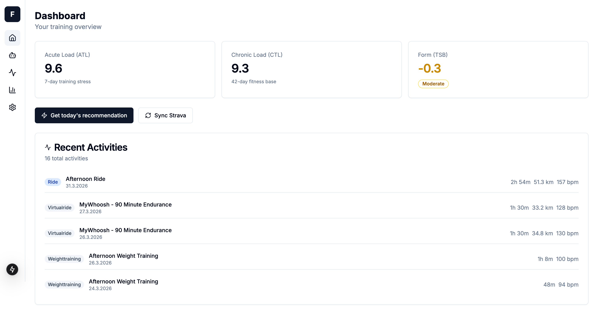
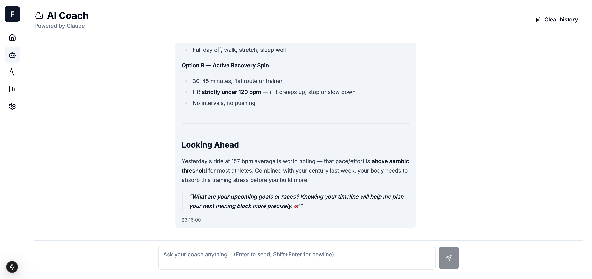
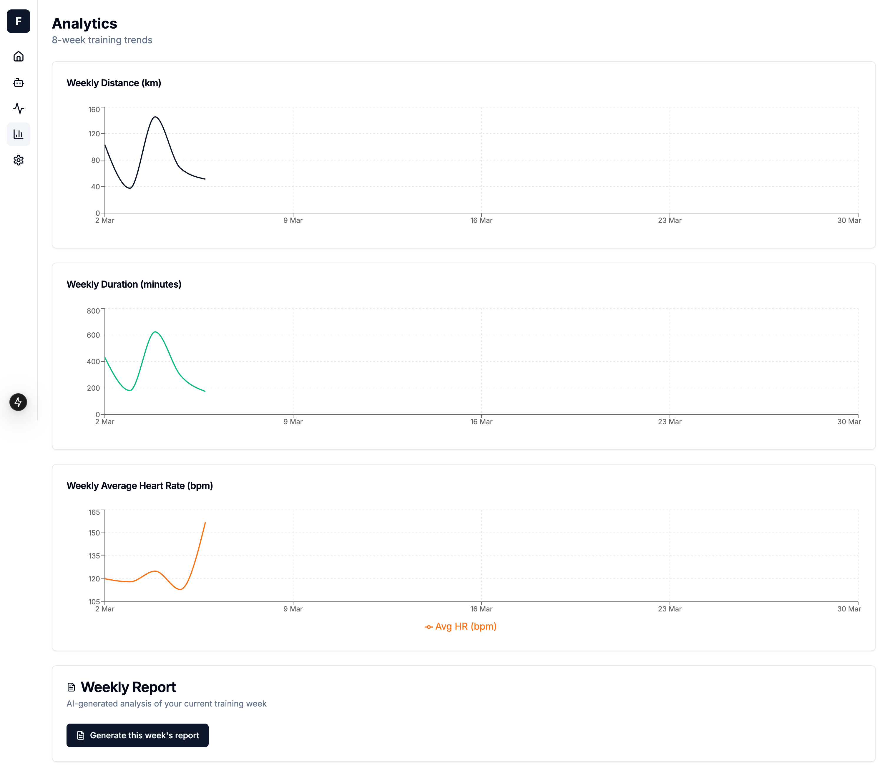
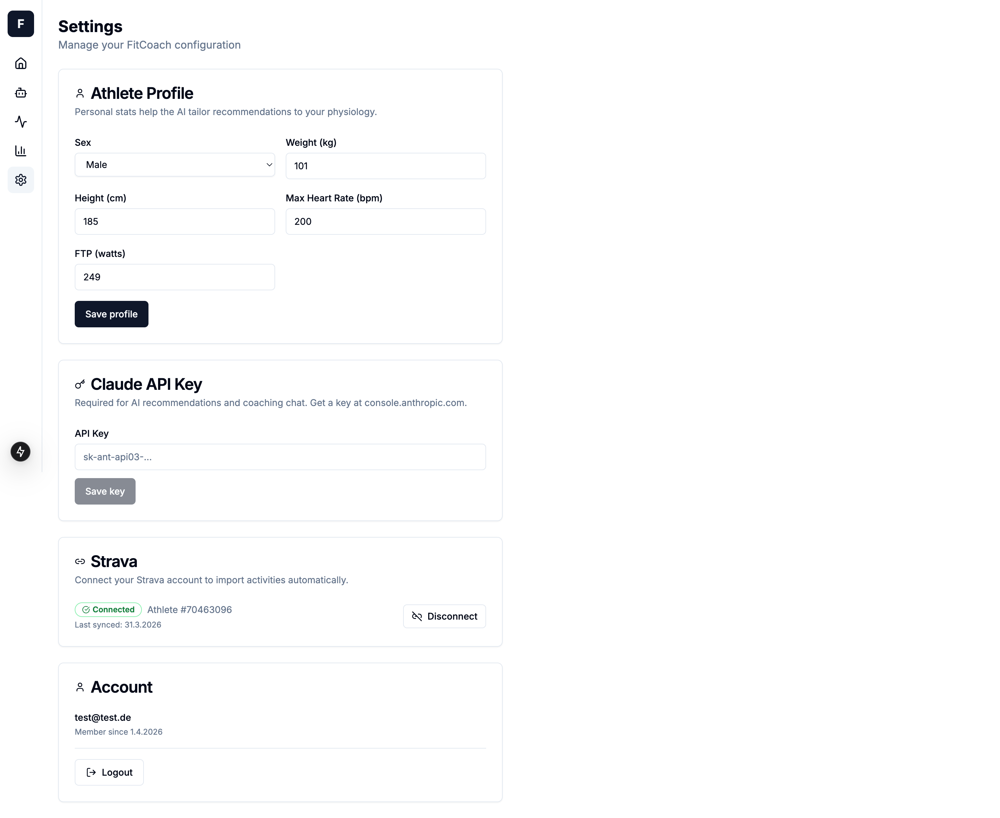

# FitCoach

[](https://sonarcloud.io/summary/new_code?id=ockiphertweck_FitCoach)

**Self-hosted AI training coach powered by Strava and Claude.**

FitCoach connects to your Strava account, computes training load metrics (ATL/CTL/TSB), and uses the Anthropic Claude API to deliver personalised coaching — daily recommendations, an interactive chat, and weekly reports. Everything runs on your own hardware. Your data never leaves your server.

> A self-hosted alternative to TrainingPeaks AI features — no subscription, no vendor lock-in, bring your own Claude API key.

---

## Features

- **Daily recommendation** — one-click "train or rest today?" answer streamed in real time from Claude, based on your current training load and recent activities
- **AI Coach chat** — persistent multi-turn conversation with Claude, aware of your activity history and athlete profile
- **Weekly reports** — AI-generated summary with distance, duration, HR, ATL/CTL, and coaching notes
- **Analytics** — interactive weekly trend charts for distance, duration, and heart rate
- **Training load** — ATL / CTL / TSB computed from TRIMP (same methodology as TrainingPeaks)
- **Strava sync** — manual sync + real-time webhook updates when you save an activity
- **Athlete profile** — weight, height, max HR, FTP, sex — passed to Claude for personalised advice
- **BYOK** — Claude API key stored AES-256-GCM encrypted; set it in Settings without redeploying
- **Single-user** — first registered account locks the instance; designed for personal self-hosting

---

## Screenshots

| Dashboard | Coach |
|---|---|
|  |  |

| Analytics | Settings |
|---|---|
|  |  |

---

## Quick Start

**Prerequisites:** Docker, pnpm ≥ 9, Node.js 22

```bash
git clone https://github.com/your-username/fitcoach
cd fitcoach
cp .env.example .env   # fill in the required values (see below)
docker compose up postgres -d
pnpm install
pnpm --filter api db:migrate
pnpm dev
```

Open **http://localhost:3001** and create your account.

---

## Environment Variables

| Variable | Required | Description |
|---|---|---|
| `JWT_SECRET` | ✅ | JWT signing secret — `openssl rand -base64 32` |
| `API_KEY_ENCRYPTION_KEY` | ✅ | AES-256-GCM key (≥ 32 chars) — `openssl rand -base64 32` |
| `DB_PASSWORD` | ✅ | PostgreSQL password |
| `DATABASE_URL` | ✅ | Full postgres connection string |
| `STRAVA_CLIENT_ID` | ✅ | From [strava.com/settings/api](https://www.strava.com/settings/api) |
| `STRAVA_CLIENT_SECRET` | ✅ | From [strava.com/settings/api](https://www.strava.com/settings/api) |
| `STRAVA_REDIRECT_URI` | ✅ | e.g. `http://localhost:3000/strava/callback` |
| `STRAVA_WEBHOOK_VERIFY_TOKEN` | optional | Required to register Strava webhooks |
| `CLAUDE_API_KEY` | optional | Default Claude key; can be set per-user in Settings |
| `POSTHOG_API_KEY` | optional | Usage analytics — disabled if omitted |
| `FRONTEND_URL` | optional | Defaults to `http://localhost:3001` |
| `TS_AUTHTOKEN` | optional | Tailscale auth key — for local webhook dev only |

---

## Connecting Strava

1. Register an app at [strava.com/settings/api](https://www.strava.com/settings/api) — set **Authorization Callback Domain** to `localhost`
2. Copy `Client ID` and `Client Secret` into `.env`
3. Open FitCoach → **Settings** → **Connect Strava**
4. Authorise — the last 30 days of activities sync automatically

---

## Architecture

```
┌──────────────────────────────────────────────────────────────────────────┐
│                              docker compose                              │
│                                                                          │
│  ┌────────────────┐   HTTP/SSE   ┌─────────────────┐                    │
│  │   Frontend     │ ──────────▶  │      API         │  ┌─────────────┐  │
│  │  Next.js 15    │              │  Fastify v5      │  │ PostgreSQL  │  │
│  │  React 19      │ ◀── stream ─ │  Zod + Drizzle   │──│  pg16 +     │  │
│  │  port 3001     │              │  port 3000       │  │  pgvector   │  │
│  └────────────────┘              └────────┬─────────┘  └─────────────┘  │
│                                           │                              │
│                                ┌──────────┴──────────┐                  │
│                                ▼                     ▼                  │
│                       ┌──────────────┐     ┌──────────────┐            │
│                       │  Strava API  │     │  Claude API  │            │
│                       │  OAuth 2.0   │     │  (BYOK)      │            │
│                       │  Webhooks    │     │  Streaming   │            │
│                       └──────────────┘     └──────────────┘            │
└──────────────────────────────────────────────────────────────────────────┘
```

**AI streaming request lifecycle:**

1. Browser `POST /ai/recommendation` with session cookie
2. API verifies JWT, decrypts the user's Claude key (AES-256-GCM)
3. Queries Postgres for 42 days of activities, computes ATL/CTL/TSB, builds a structured prompt
4. Opens an Anthropic streaming request, forwards `data:` SSE chunks on the same HTTP response
5. Frontend reads via `ReadableStream`, appends each delta to React state → `react-markdown` renders live
6. After stream ends, full response + token counts written to `chat_history` (fire-and-forget)

---

## Monorepo Structure

```
fitcoach/
├── apps/
│   ├── api/               # Fastify REST + SSE API
│   │   ├── src/
│   │   │   ├── db/        # Drizzle ORM client & schema
│   │   │   ├── middleware/ # JWT auth hook
│   │   │   ├── routes/    # activities · ai · auth · settings · strava
│   │   │   └── services/  # ai-context · atl-ctl · encryption · strava-client
│   │   └── drizzle/       # SQL migration files
│   └── frontend/          # Next.js 15 App Router
│       └── src/
│           ├── app/       # Route segments: activities · analytics · coach · settings
│           ├── components/ # shadcn/ui primitives + shared Markdown renderer
│           └── lib/       # Typed API client + SSE streaming helper
├── packages/
│   └── shared/            # Zod schemas shared between API and frontend
├── db/
│   └── init.sql           # pgvector / pgcrypto bootstrap
├── docker-compose.yml
└── docker-compose.override.yml  # dev Tailscale Funnel overlay
```

---

## Tech Stack & Key Design Decisions

### Fastify v5 + `fastify-type-provider-zod`

`fastify-type-provider-zod` bridges Fastify's validation pipeline with Zod — the same schema that defines TypeScript types also validates requests at runtime, with no duplication. Fastify v5 uses native async/await throughout and has measurably lower latency than Express.

### Drizzle ORM over Prisma

Drizzle is a pure query builder — zero runtime overhead, no code generation, no separate schema language. The schema in `apps/api/src/db/schema.ts` is the single source of truth; Drizzle Kit infers migrations from it. Result types are plain TypeScript objects.

### SSE over WebSockets for streaming

LLM output is unidirectional (server → client), which makes Server-Sent Events the right fit — no upgrade negotiation, works through most proxies, and the client is ~40 lines of `fetch` + `ReadableStream` with no dependencies. `X-Accel-Buffering: no` disables proxy buffering in production.

### JWT in HTTP-only cookie

- `httpOnly: true` — inaccessible to JavaScript; prevents XSS theft
- `secure: true` in production — HTTPS only
- `sameSite: "lax"` — blocks cross-site POST (CSRF protection)
- Verified with `jose` (ESM-native, no `node:crypto` shims needed)

### AES-256-GCM for credential storage

Strava tokens and user-supplied API keys are encrypted before hitting the database. Each `encrypt()` call uses a fresh random 12-byte IV; the GCM auth tag rejects tampered ciphertexts at decryption. The encryption key never touches the database.

### pgvector included

The Postgres image includes `pgvector` for potential semantic search over activity data without a separate vector database.

### Biome over ESLint + Prettier

One Rust-based tool, one config file, zero conflicts between linter and formatter.

---

## Data Model

```
users              id, email, passwordHash, createdAt
apiKeys            userId → users, provider, encryptedKey  — UNIQUE(userId, provider)
stravaTokens       userId → users, accessToken*, refreshToken*, expiresAt, athleteId  — UNIQUE(userId)
userProfiles       userId → users (PK), sex, weightKg, heightCm, maxHeartRate, ftpWatts
activities         userId → users, externalId, source, sportType, startDate,
                   duration, distance, elevation, HR, pace, RPE, calories,
                   rawData (jsonb)  — UNIQUE(userId, externalId, source)
chatHistory        userId → users, role, content, tokensUsed, createdAt
weeklyReports      userId → users, weekStart, summary, metrics (jsonb)  — UNIQUE(userId, weekStart)
```

`*` encrypted at rest with AES-256-GCM

**Notable choices:**
- `rawData jsonb` preserves the full Strava payload — new fields can be surfaced without a schema migration
- `UNIQUE(userId, externalId, source)` on activities enables safe upsert from both initial sync and webhook events
- `userProfiles` is a separate table (not columns on `users`) so it can be left entirely empty without nulls polluting the users row

---

## Training Science — ATL / CTL / TSB

FitCoach models training load using **TRIMP** (Training Impulse) — the same methodology behind TrainingPeaks.

**Session load:**
```
sessionLoad = durationHours × intensity
```
`intensity` priority: RPE (1–10) → avg heart rate ÷ 10 → 5 (default)

**ATL and CTL** are Exponentially Weighted Moving Averages walked day-by-day (so rest days correctly decay both values):

| Metric | Window | Alpha | Meaning |
|---|---|---|---|
| ATL — Acute Training Load | 7 days | 0.25 | Short-term fatigue |
| CTL — Chronic Training Load | 42 days | ≈ 0.046 | Long-term fitness |
| TSB — Training Stress Balance | CTL − ATL | — | Form / freshness |

TSB > +5 → fresh. TSB < −10 → accumulating fatigue.

---

## API Reference

All routes except `/auth/*` and the Strava webhook endpoint require a valid `fitcoach_token` cookie.

| Method | Path | Description |
|---|---|---|
| `GET` | `/auth/status` | First-run check — returns `{ setup: boolean }` |
| `POST` | `/auth/setup` | Create account + set session cookie |
| `POST` | `/auth/login` | Validate credentials + set session cookie |
| `POST` | `/auth/logout` | Clear session cookie |
| `GET` | `/auth/me` | Current user |
| `GET` | `/activities` | Paginated list — `limit`, `offset`, `sport`, `from`, `to` |
| `GET` | `/activities/stats` | Current `{ atl, ctl, tsb }` |
| `GET` | `/activities/:id` | Single activity |
| `POST` | `/ai/recommendation` | Stream daily recommendation (SSE) |
| `POST` | `/ai/chat` | Stream chat reply (SSE) |
| `GET` | `/ai/chat/history` | Chat history |
| `DELETE` | `/ai/chat/history` | Clear chat history |
| `POST` | `/ai/weekly-report` | Generate / return this week's report |
| `GET` | `/strava/connect` | Redirect to Strava OAuth |
| `GET` | `/strava/callback` | OAuth callback handler |
| `GET` | `/strava/status` | Connection status |
| `POST` | `/strava/sync` | Manual activity sync |
| `DELETE` | `/strava/disconnect` | Remove Strava tokens |
| `GET/POST` | `/strava/webhook` | Strava webhook (public) |
| `GET` | `/settings/apikey` | Configured providers |
| `POST` | `/settings/apikey` | Save encrypted API key |
| `DELETE` | `/settings/apikey/:provider` | Remove API key |
| `GET` | `/settings/profile` | Athlete profile |
| `PUT` | `/settings/profile` | Update athlete profile |

---

## Development

```bash
# Start only the database
docker compose up postgres -d

# API (hot reload) + frontend (hot reload)
pnpm dev

# Full Docker stack
docker compose up -d --build

# Strava webhooks locally (requires TS_AUTHTOKEN in .env)
docker compose -f docker-compose.yml -f docker-compose.override.yml up -d
# Public URL: https://fitcoach-dev.<tailnet>.ts.net
```

**Other tools:**

```bash
pnpm --filter api db:generate   # generate migration after schema change
pnpm --filter api db:migrate    # apply pending migrations
pnpm --filter api db:studio     # Drizzle Studio — visual DB browser (localhost:4983)
pnpm --filter api test          # run unit tests
pnpm --filter api test:coverage # coverage report → apps/api/coverage/index.html
```

pgAdmin is available at `http://localhost:5050` when running the override compose file.

---

## Data Privacy

FitCoach is **fully self-hosted** — all activity data, chat history, and credentials live in your local PostgreSQL database. The only external calls are:

- **Anthropic Claude API** — recent activities and chat messages are sent to generate AI responses. [Anthropic privacy policy](https://www.anthropic.com/privacy).
- **Strava API** — activity data is fetched and stored locally.
- **PostHog** (optional) — usage analytics only, no health data. EU instance by default.

**To delete all data:** `docker compose down -v`

---

## Contributing

Issues and PRs are welcome. Please open an issue before starting significant work.

---

## License

MIT
